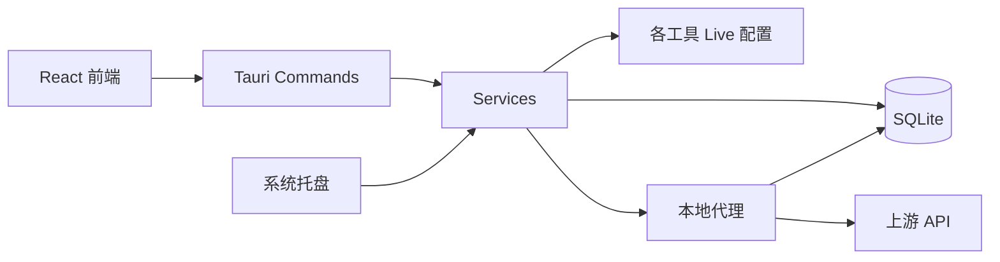
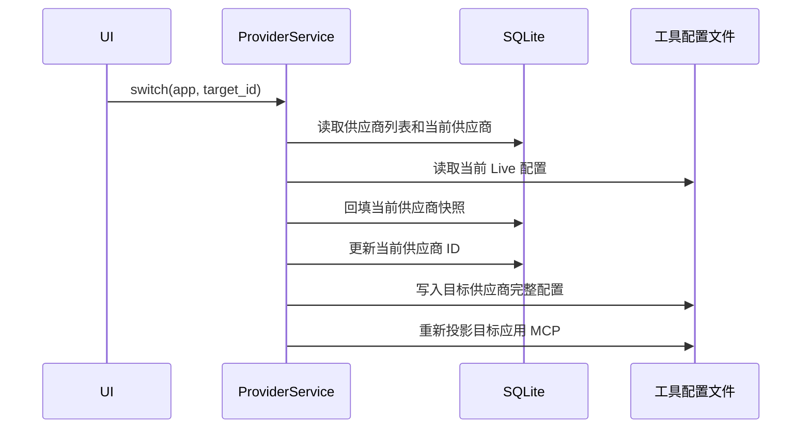

# CC Switch 调研报告

> 调研日期：2026-07-13
>
> 调研对象：[farion1231/cc-switch](https://github.com/farion1231/cc-switch)
>
> 本地提交：`f39d463c`
>
> Git 描述：`v3.16.5-45-gf39d463c`

## 1. 调研目的

本报告为 Code Agent Switch（命令名 `cas`）提供设计依据。

Code Agent Switch 计划解决下面几件事：

- 管理 Claude Code、Codex 和 OpenCode 的多个 API 供应商。
- 供应商只保存 `base_url`、API Key、协议、模型等少量差异字段。
- 用户继续直接维护各工具原有的完整配置。
- 普通切换只修改供应商相关字段。
- 本地代理支持热切换，切换供应商后无需重新启动 Code Agent。
- 管理三种工具的 MCP 开启与关闭。
- 使用 Python、Textual 和 `uv` 构建 CLI 与 TUI。
- 后续可增加 macOS 菜单栏入口。

调研重点如下：

1. CC Switch 如何保存供应商。
2. 普通切换如何读写应用配置。
3. 通用配置片段如何缓解完整配置重复问题。
4. 本地代理如何接管配置并实现热切换。
5. OpenCode 为什么没有接入 CC Switch 的代理。
6. MCP 如何在多个工具之间保存、转换和同步。
7. 哪些实现值得借用，哪些设计会让项目继续变大。

## 2. 调研方法

本次调研采用只读方式，主要依据包括：

- CC Switch 当前源码。
- Git 提交历史。
- README 和用户手册。
- 本机 CC Switch SQLite 数据库的结构和统计数据。
- 本机 Claude Code、Codex 和 OpenCode 配置文件的字段结构。

调研期间没有修改 CC Switch，也没有输出 API Key、Token、供应商名称或其他凭据。

## 3. 项目概况

CC Switch 当前已经成为一个面向多种 AI 编程工具的桌面管理中心。它支持：

- Claude Code
- Claude Desktop
- Codex
- Gemini CLI
- OpenCode
- OpenClaw
- Hermes Agent

主要功能包括：

- 供应商增删改查与切换
- 本地代理与协议转换
- 自动故障转移与熔断
- MCP、Skills 和 Prompts 管理
- 会话管理
- 用量、价格和请求日志统计
- OAuth 与订阅额度查询
- 云同步、备份和恢复
- Deep Link 导入
- 系统托盘快速切换
- OpenClaw 与 Hermes 专属管理页面

### 3.1 代码规模

以下数据来自本地提交 `f39d463c`：

| 区域 | 行数或数量 |
| --- | ---: |
| 前端业务代码 `src/**/*.ts(x)` | 79,875 行 |
| 前端测试 `tests/**/*.ts(x)` | 13,148 行 |
| Rust 业务代码 `src-tauri/src/**/*.rs` | 139,923 行 |
| Rust 测试 `src-tauri/tests/**/*.rs` | 7,667 行 |
| 文档 `docs/**/*.md` | 40,055 行 |
| i18n JSON | 11,920 行 |
| `#[tauri::command]` | 267 个 |
| 前端 View | 14 个 |
| 支持的应用类型 | 7 个 |

代理目录 `src-tauri/src/proxy` 约 50,690 行。再加上 6,258 行的 `services/proxy.rs`，代理相关实现已经超过 5.6 万行。

较大的文件包括：

| 文件 | 行数 |
| --- | ---: |
| `src-tauri/src/services/proxy.rs` | 6,258 |
| `src-tauri/src/commands/misc.rs` | 5,329 |
| `src-tauri/src/proxy/forwarder.rs` | 4,277 |
| `src-tauri/src/services/usage_stats.rs` | 4,068 |
| `src-tauri/src/services/provider/mod.rs` | 3,774 |
| `src-tauri/src/codex_config.rs` | 3,141 |
| `src/components/providers/forms/ProviderForm.tsx` | 2,554 |
| `src/config/openclawProviderPresets.ts` | 2,506 |
| `src/App.tsx` | 1,665 |

这些数字说明 CC Switch 的复杂度来自产品范围和状态组合，单纯更换前端框架无法解决。

## 4. 整体架构

CC Switch 使用 React、Tauri 和 Rust：



主要职责如下：

- React 负责供应商表单、设置页面、代理面板、MCP 面板等界面。
- Tauri command 是前后端调用入口。
- Service 层处理供应商切换、MCP 同步、代理接管等业务。
- SQLite 保存供应商、MCP、代理状态、请求日志和用量数据。
- 各工具的配置文件是运行时配置，代码中常称为 Live 配置。
- 本地代理根据当前供应商读取上游地址和凭据。
- 系统托盘调用同一套供应商切换服务。

## 5. 供应商数据模型

CC Switch 的供应商结构定义在 [`provider.rs`](https://github.com/farion1231/cc-switch/blob/f39d463c442e705727531b85f2db98e00ccaf11e/src-tauri/src/provider.rs#L11)：

```rust
pub struct Provider {
    pub id: String,
    pub name: String,
    pub settings_config: Value,
    pub website_url: Option<String>,
    pub category: Option<String>,
    pub meta: Option<ProviderMeta>,
    // 其他展示、统计和故障转移字段
}
```

`settings_config` 是核心字段。它通常保存一份完整配置或完整供应商配置块。

### 5.1 两种应用模式

[`AppType::is_additive_mode`](https://github.com/farion1231/cc-switch/blob/f39d463c442e705727531b85f2db98e00ccaf11e/src-tauri/src/app_config.rs#L369) 将应用分成两类：

| 模式 | 应用 | 行为 |
| --- | --- | --- |
| 排他模式 | Claude、Codex、Gemini | 只有一个当前供应商，切换时写入目标配置 |
| 累加模式 | OpenCode、OpenClaw、Hermes | 多个供应商同时存在于 Live 配置 |

这种分类符合各工具的配置格式，但排他模式与完整快照结合后，会产生公共配置重复问题。

### 5.2 Claude Code 供应商

Claude Code 的 `settings_config` 形态接近完整 `settings.json`：

```json
{
  "env": {
    "ANTHROPIC_BASE_URL": "https://example.com",
    "ANTHROPIC_AUTH_TOKEN": "***",
    "ANTHROPIC_MODEL": "model-name",
    "ANTHROPIC_DEFAULT_HAIKU_MODEL": "model-name",
    "ANTHROPIC_DEFAULT_SONNET_MODEL": "model-name",
    "ANTHROPIC_DEFAULT_OPUS_MODEL": "model-name"
  },
  "permissions": {},
  "enabledPlugins": {}
}
```

供应商表单允许编辑整份配置。普通写入会将供应商配置写入 `~/.claude/settings.json`。

[`write_live_snapshot`](https://github.com/farion1231/cc-switch/blob/f39d463c442e705727531b85f2db98e00ccaf11e/src-tauri/src/services/provider/live.rs#L782) 的 Claude 分支会调用 `write_json_file` 写入完整 JSON。`write_json_file` 还会按字母重新排列 JSON 键。

因此，存储快照里缺少的字段可能在切换时消失。通用配置片段是 CC Switch 后续为此增加的修正机制。

### 5.3 Codex 供应商

Codex 的 `settings_config` 保存两部分：

```json
{
  "auth": {
    "OPENAI_API_KEY": "***"
  },
  "config": "完整的 config.toml 文本",
  "modelCatalog": {
    "models": []
  }
}
```

普通切换会写入目标供应商保存的整段 `config.toml`。实现入口位于：

- [`write_live_snapshot`](https://github.com/farion1231/cc-switch/blob/f39d463c442e705727531b85f2db98e00ccaf11e/src-tauri/src/services/provider/live.rs#L782)
- [`write_codex_live_for_provider`](https://github.com/farion1231/cc-switch/blob/f39d463c442e705727531b85f2db98e00ccaf11e/src-tauri/src/codex_config.rs#L1549)

新版增加了一个重要保护：第三方供应商可以把 API Key 放入当前 model provider 的 `experimental_bearer_token`，同时保留官方 OAuth 的 `auth.json`。这项处理值得 Code Agent Switch 借用。

### 5.4 OpenCode 供应商

OpenCode 自身支持多个 provider，CC Switch 将单个 provider 保存为：

```json
{
  "npm": "@ai-sdk/openai-compatible",
  "options": {
    "baseURL": "https://example.com/v1",
    "apiKey": "***"
  },
  "models": {
    "model-id": {
      "name": "Model Name"
    }
  }
}
```

写入时，CC Switch 读取完整 `opencode.json`，修改 `provider.<id>`，再写回完整文件。实现位于 [`opencode_config.rs`](https://github.com/farion1231/cc-switch/blob/f39d463c442e705727531b85f2db98e00ccaf11e/src-tauri/src/opencode_config.rs#L89)。

读取使用 JSON5 解析器，写入使用排序后的标准 JSON。若用户原文件含 JSON5 注释，写回后注释会消失。这一点需要在 Code Agent Switch 中避免或明确提示。

### 5.5 Universal Provider

CC Switch 还有一套 Universal Provider：一份 `baseUrl` 和 `apiKey` 可以生成 Claude、Codex 和 Gemini 子供应商。

它仍然会生成并保存多份子供应商。后续修改 Universal Provider 后，需要再次同步。实现位于 [`sync_universal_to_apps`](https://github.com/farion1231/cc-switch/blob/f39d463c442e705727531b85f2db98e00ccaf11e/src-tauri/src/services/provider/mod.rs#L3701)。

这套设计减少了录入工作，但没有建立运行时引用关系。数据仍然存在多份副本。

## 6. 普通供应商切换流程

普通切换主流程位于 [`ProviderService::switch`](https://github.com/farion1231/cc-switch/blob/f39d463c442e705727531b85f2db98e00ccaf11e/src-tauri/src/services/provider/mod.rs#L2334)。

排他模式的流程如下：



这套流程希望同时保存两类修改：

- 用户在 CC Switch 表单内做的供应商修改。
- 用户直接在 Claude Code 或 Codex 配置里做的修改。

为此，系统加入了回填、通用配置提取、MCP 剥离、模型目录恢复等多个步骤。

### 6.1 状态组合

普通切换涉及以下状态：

- 数据库里的供应商快照。
- 数据库里的当前供应商。
- 本机设置里的设备级当前供应商。
- Live 配置文件。
- 通用配置片段。
- MCP 数据库定义与 Live 投影。
- Codex 官方 OAuth `auth.json`。
- Codex 模型目录文件。

当代理接管开启后，还会增加：

- 代理接管标记。
- Live 配置备份。
- Live 配置中的代理占位字段。
- 代理服务的运行状态。
- 代理内存中的活动目标。

大量修复集中在这些状态之间的同步顺序和异常恢复上。

## 7. 通用配置片段

CC Switch 为 Claude、Codex 等应用增加了按应用保存的通用配置片段。结构定义在 [`CommonConfigSnippets`](https://github.com/farion1231/cc-switch/blob/f39d463c442e705727531b85f2db98e00ccaf11e/src-tauri/src/app_config.rs#L417)。

### 7.1 Claude 提取规则

Claude 提取器会从完整配置中删除供应商字段：

- `ANTHROPIC_BASE_URL`
- API Key、Token、Secret、Password 等敏感字段
- 主模型和各角色模型
- 旧版 `apiBaseUrl`、`primaryModel` 等字段

其余字段作为通用配置保存，例如：

- 权限
- 插件状态
- Hooks
- 超时
- 遥测设置
- 用户界面偏好

实现见 [`extract_claude_common_config`](https://github.com/farion1231/cc-switch/blob/f39d463c442e705727531b85f2db98e00ccaf11e/src-tauri/src/services/provider/mod.rs#L2907)。

### 7.2 Codex 提取规则

Codex 提取器会删除：

- `model`
- `model_provider`
- 顶层 `base_url`
- 顶层 `wire_api`
- 整张 `model_providers` 表
- `mcp_servers`
- `experimental_bearer_token`
- `model_catalog_json`
- CC Switch 注入的特殊字段

其余内容成为通用 TOML 片段。实现见 [`extract_codex_common_config`](https://github.com/farion1231/cc-switch/blob/f39d463c442e705727531b85f2db98e00ccaf11e/src-tauri/src/services/provider/mod.rs#L2982)。

### 7.3 写入和回填

启用通用配置的供应商在写入 Live 前会进行合并：

```text
有效配置 = 供应商快照 + 通用配置片段
```

切走当前供应商时，会执行：

1. 从 Live 重新提取通用配置。
2. 用新提取结果替换旧通用配置。
3. 从 Live 中删除通用片段。
4. 将剩余部分回填到当前供应商快照。

### 7.4 局限

通用配置片段改善了快照之间的同步，但仍有几个限制：

- 供应商需要显式启用通用配置。
- 识别依赖字段排除规则。
- 新增供应商字段后可能需要更新排除列表。
- 错误归类可能把供应商字段传播给其他供应商。
- 错误归类也可能让公共字段无法传播。
- 数组合并和删除需要额外的子集比较逻辑。
- MCP、模型目录、OAuth 等字段还需要专门处理。
- OpenCode 和 OpenClaw 的通用配置合并路径并未真正启用。

2026 年 6 月和 7 月的提交历史中，多次出现通用配置、MCP、模型目录和代理恢复方面的修复。这说明修正机制本身已经形成较大的维护成本。

## 8. 本机数据验证

本次调研只统计结构和数量，没有记录供应商名称或凭据。

### 8.1 本机 Live 配置

| 配置文件 | 行数 |
| --- | ---: |
| `~/.codex/config.toml` | 201 |
| `~/.claude/settings.json` | 57 |
| `~/.claude.json` | 4,751 |
| `~/.config/opencode/opencode.json` | 1,727 |

本机 Codex 配置包含：

- 模型和推理设置
- 审批和沙箱设置
- Features
- Agents
- History
- Analytics
- TUI
- 多个项目的 Trust 设置
- Marketplaces
- Plugins
- MCP Servers
- Codex Desktop 设置

供应商相关字段只占其中很小一部分。

### 8.2 CC Switch 数据库

本机 `~/.cc-switch/cc-switch.db` 大约 40 MB。数据库体积包含请求日志、用量等数据，不能全部归到供应商管理。

供应商数量如下：

| 应用 | 数量 |
| --- | ---: |
| Claude | 28 |
| Claude Desktop | 46 |
| Codex | 8 |
| Gemini | 2 |
| OpenCode | 17 |
| 合计 | 101 |

8 个 Codex 供应商各自保存了一段完整 TOML：

- 最少 198 行
- 最多 231 行
- 当前供应商 198 行
- 8 个供应商均未启用 `commonConfigEnabled`

这组数据直接说明公共 Codex 配置存在多份副本。修改当前 `config.toml` 后，其他供应商不会自然获得相同修改。

### 8.3 MCP 数据

本机 CC Switch 数据库保存了 14 个 MCP 定义。Claude、Codex 和 OpenCode 当前各有 1 个启用项。

这也说明 MCP 的开关状态与供应商配置属于两个不同维度，二者需要分开管理。

## 9. 代理接管与热切换

代理主服务位于 [`services/proxy.rs`](https://github.com/farion1231/cc-switch/blob/f39d463c442e705727531b85f2db98e00ccaf11e/src-tauri/src/services/proxy.rs)，HTTP 服务器位于 [`proxy/server.rs`](https://github.com/farion1231/cc-switch/blob/f39d463c442e705727531b85f2db98e00ccaf11e/src-tauri/src/proxy/server.rs)。

### 9.1 开启接管

开启代理接管并非完全不修改配置。主要步骤如下：

1. 备份当前 Live 配置。
2. 将 Live 中的当前凭据同步回供应商数据库。
3. 保存接管标记。
4. 将 Live 的上游地址改成本地代理地址。
5. 将凭据替换为代理占位值。
6. 启动代理服务器。

各应用的改动如下：

| 应用 | 接管时修改的字段 |
| --- | --- |
| Claude | `ANTHROPIC_BASE_URL`、认证占位值、部分模型字段 |
| Codex | 当前 model provider 的 `base_url`、`wire_api`、认证占位值 |
| Gemini | `GOOGLE_GEMINI_BASE_URL`、`GEMINI_API_KEY` 占位值 |

### 9.2 热切换

接管开启后的热切换流程位于 [`hot_switch_provider_inner`](https://github.com/farion1231/cc-switch/blob/f39d463c442e705727531b85f2db98e00ccaf11e/src-tauri/src/services/proxy.rs#L2141)：

1. 校验目标供应商。
2. 更新数据库和设备级当前供应商。
3. 根据目标供应商重建恢复用备份。
4. 必要时更新 Live 中的代理安全字段。
5. 更新代理界面显示的活动目标。

代理处理新请求时会读取当前供应商，因此无需重启客户端。

### 9.3 停止与恢复

关闭接管时，CC Switch 会尝试：

1. 从备份恢复 Live 配置。
2. 备份缺失时从数据库当前供应商重建。
3. 仍无法恢复时删除代理占位字段。
4. 删除敏感备份。
5. 清理接管状态。
6. 没有其他应用接管时停止代理。

这些恢复路径来自真实故障：应用退出、端口变化、配置目录变化或进程异常结束后，Live 配置可能仍指向已经停止的本地代理。

### 9.4 代理路由方式

CC Switch 在一个端口监听，并根据路径判断应用类型：

| 请求路径 | 归属 |
| --- | --- |
| `/v1/messages` | Claude |
| `/v1/responses` | Codex |
| `/v1/chat/completions` | Codex |
| `/v1beta/*` | Gemini |

路由定义见 [`ProxyServer::build_router`](https://github.com/farion1231/cc-switch/blob/f39d463c442e705727531b85f2db98e00ccaf11e/src-tauri/src/proxy/server.rs#L291)。

### 9.5 OpenCode 没有代理接管

[`get_takeover_status`](https://github.com/farion1231/cc-switch/blob/f39d463c442e705727531b85f2db98e00ccaf11e/src-tauri/src/services/proxy.rs#L600) 明确将 OpenCode 和 OpenClaw 的代理状态固定为 `false`。

OpenCode 可以使用 Anthropic、OpenAI Responses 或 OpenAI Compatible 协议。若它发送 `/v1/messages`，单看路径无法判断请求来自 OpenCode 还是 Claude Code。

Code Agent Switch 需要主动解决这个问题。推荐方案是：

- 一个代理进程。
- Claude、Codex、OpenCode 分别监听独立端口。
- 每个监听端口绑定明确的应用与活动供应商。

这种方式比路径猜测更清楚，也便于分别显示状态和切换供应商。

## 10. 代理体量为什么增长

CC Switch 的代理已经包含：

- Anthropic Messages 透传
- OpenAI Responses 透传
- OpenAI Chat Completions 透传
- Gemini Native 透传
- 多种协议互转
- 流式 SSE 双向转换
- 模型名映射
- Thinking 字段修正
- 图片与媒体处理
- Header 大小写保留
- 内容压缩与解压
- 超时与重试
- 自动故障转移
- 熔断器
- 健康状态
- 使用量解析
- 请求日志
- 模型价格计算
- GitHub Copilot OAuth
- Codex OAuth
- 请求覆盖规则
- 上游代理

其中协议转换相关文件就超过 2.8 万行。

Code Agent Switch 第一阶段只需完成：

- 同协议请求转发
- 上游 URL 组合
- 认证头替换
- 请求头清理
- 流式响应透传
- 基本超时
- 健康检查
- 活动供应商原子切换

协议转换会显著增加请求、响应、流式事件、工具调用、错误格式和模型能力的适配工作，适合在有明确需求时单独评估。

## 11. MCP 管理

### 11.1 CC Switch 的 MCP 数据模型

统一 MCP 结构定义在 [`McpServer`](https://github.com/farion1231/cc-switch/blob/f39d463c442e705727531b85f2db98e00ccaf11e/src-tauri/src/app_config.rs#L222)：

```rust
pub struct McpServer {
    pub id: String,
    pub name: String,
    pub server: Value,
    pub apps: McpApps,
}
```

SQLite 保存：

- MCP 定义
- `enabled_claude`
- `enabled_codex`
- `enabled_gemini`
- `enabled_opencode`
- `enabled_hermes`

### 11.2 开关行为

[`McpService::toggle_app`](https://github.com/farion1231/cc-switch/blob/f39d463c442e705727531b85f2db98e00ccaf11e/src-tauri/src/services/mcp.rs#L69) 的行为如下：

- 开启：把数据库中的定义写入目标工具。
- 关闭：从目标工具的 Live 配置删除对应定义。

所以，只保存布尔开关无法完整支持 Claude 和 Codex。关闭时定义会从 Live 配置消失，管理工具必须保存定义，才能再次开启。

### 11.3 三种工具的格式差异

| 工具 | 位置 | 主要结构 |
| --- | --- | --- |
| Claude Code | `~/.claude.json` | `mcpServers.<id>` |
| Codex | `~/.codex/config.toml` | `[mcp_servers.<id>]` |
| OpenCode | `~/.config/opencode/opencode.json` | `mcp.<id>` |

OpenCode 还使用不同字段：

- `stdio` 对应 `local`
- `command + args` 对应命令数组
- `env` 对应 `environment`
- `http/sse` 对应 `remote`
- OpenCode 原生支持 `enabled`

CC Switch 会在统一格式和 OpenCode 格式之间转换，代码位于 [`mcp/opencode.rs`](https://github.com/farion1231/cc-switch/blob/f39d463c442e705727531b85f2db98e00ccaf11e/src-tauri/src/mcp/opencode.rs)。

### 11.4 对 Code Agent Switch 的建议

Code Agent Switch 只做 MCP 开关时，可以保存每个应用的原始定义：

```toml
[mcp.tinyfish]
name = "tinyfish"

[mcp.tinyfish.apps.claude]
enabled = false
raw = """{ ... }"""

[mcp.tinyfish.apps.codex]
enabled = true
raw = """command = "..."""

[mcp.tinyfish.apps.opencode]
enabled = true
raw = """{ ... }"""
```

保存原始定义有几个好处：

- 保留每个工具的扩展字段。
- 避免格式转换损失信息。
- 用户可以给同名 MCP 在不同工具中设置不同参数。
- 开关逻辑只负责写入或移除。

导入时应遵循：

- Live 中存在的定义视为当前启用定义。
- 已由 `cas` 保存但 Live 中不存在的定义视为关闭。
- Live 定义发生变化时，用户可以显式重新导入或更新保存值。
- 解析失败时不写文件。

## 12. 系统托盘与菜单栏

CC Switch 使用 Tauri Tray。菜单按 Claude、Codex、Gemini 分组，点击供应商后调用同一个 `ProviderService::switch`。代码位于 [`tray.rs`](https://github.com/farion1231/cc-switch/blob/f39d463c442e705727531b85f2db98e00ccaf11e/src-tauri/src/tray.rs#L121)。

OpenCode 没有进入当前托盘供应商分组。

Code Agent Switch 使用 Python 与 Textual 时，可以采用三个入口：

```text
核心服务
├── cas                 Textual TUI
├── cas use ...         CLI 快速切换
└── cas menubar         macOS 菜单栏进程
```

菜单栏可以使用 `rumps` 或 PyObjC。菜单栏只负责：

- 显示当前供应商。
- 按应用列出供应商。
- 点击切换。
- 显示代理状态。
- 打开 TUI。

供应商切换、配置写入和代理控制必须位于独立核心模块，TUI 与菜单栏调用同一套接口。

## 13. 对前面对话的修正

Grok 对话中的总体方向基本正确：

- CC Switch 的产品范围很大。
- 完整供应商快照会复制公共配置。
- Code Agent Switch 应采用差异字段模型。
- Python 与 Textual适合快速构建完成度较高的 TUI。
- CLI、TUI 和菜单栏应共享核心逻辑。

源码调研后，需要修正几处表述：

1. 代理接管开启时会修改 Live 配置，只是之后的热切换通常无需再次写入真实上游地址。
2. CC Switch 当前代理不支持 OpenCode。
3. MCP 不能只保存开关。Claude 和 Codex 关闭 MCP 时需要移除定义，管理工具必须保存可恢复的定义。
4. 新版 CC Switch 已经加入 Claude 和 Codex 的通用配置自动提取，但底层仍然是完整快照。
5. OpenCode 是累加模式，本身可以保存多个 provider，普通“当前供应商”概念与 Claude、Codex 不同。
6. CC Switch 已经处理 Codex 官方 OAuth 保留问题，这部分经验应直接吸收。

## 14. Code Agent Switch 的推荐模型

### 14.1 供应商主体

一个供应商可以为多个工具提供服务，但每个工具的端点和协议可以不同：

```toml
[[providers]]
id = "example"
name = "Example"

[providers.targets.claude]
base_url = "https://example.com/anthropic"
secret_ref = "keychain:cas/example/claude"
auth = "bearer"
protocol = "anthropic"
model = "claude-model"

[providers.targets.codex]
base_url = "https://example.com/v1"
secret_ref = "keychain:cas/example/codex"
auth = "bearer"
protocol = "openai_responses"
model = "gpt-model"
wire_api = "responses"

[providers.targets.opencode]
base_url = "https://example.com/v1"
secret_ref = "keychain:cas/example/opencode"
auth = "bearer"
protocol = "openai_compatible"
```

`secret_ref` 只表示数据关系，具体密钥存储方案仍需单独确定。第一阶段可以使用权限为 `0600` 的本地配置，macOS Keychain 可以作为后续增强。

### 14.2 直写模式

每个工具定义明确的字段范围：

| 工具 | `cas` 可修改的字段 |
| --- | --- |
| Claude | Base URL、认证字段、可选模型映射 |
| Codex | 保留的 `cas` model provider 表、可选顶层模型字段 |
| OpenCode | 保留的 `provider.cas` 配置块 |

其他字段完全保留，例如：

- Codex 的审批、沙箱、Features、Projects、Plugins、TUI 和 MCP。
- Claude 的权限、Hooks、Plugins、状态栏和超时。
- OpenCode 的其他 providers、plugins、MCP 和用户设置。

### 14.3 代理模式

推荐使用一个进程和三个监听端口：

```text
Claude Code -> 127.0.0.1:<claude-port> -> Claude 当前上游
Codex       -> 127.0.0.1:<codex-port>  -> Codex 当前上游
OpenCode    -> 127.0.0.1:<open-port>   -> OpenCode 当前上游
```

热切换语义应明确：

- 已经开始的请求继续使用创建请求时的供应商。
- 新请求读取新的活动供应商。
- 活动供应商写入本地状态文件。
- 更新状态文件采用原子替换。
- 代理读取配置时使用不可变快照。
- 切换不重启监听器。

### 14.4 配置接管

代理启用时只修改受管理字段，并记录这些字段原来的值：

```text
原值记录
├── 字段路径
├── 原值是否存在
├── 原值
└── 写入后的 cas 标记值
```

关闭代理时，仅在当前值仍等于 `cas` 写入值时恢复原值。这样可以避免覆盖用户在代理运行期间手工修改的配置。

该机制只保存有限字段，无需保存完整 Live 配置快照。

## 15. 推荐模块边界

建议的 Python 包结构如下：

```text
src/code_agent_switch/
├── cli.py
├── application/
│   ├── providers.py
│   ├── proxy.py
│   └── mcp.py
├── domain/
│   ├── provider.py
│   ├── target.py
│   └── mcp.py
├── adapters/
│   ├── base.py
│   ├── claude.py
│   ├── codex.py
│   └── opencode.py
├── storage/
│   ├── config.py
│   ├── secrets.py
│   └── atomic.py
├── proxy/
│   ├── server.py
│   ├── forwarding.py
│   └── runtime.py
├── tui/
│   ├── app.py
│   ├── screens/
│   └── widgets/
└── menubar/
    └── app.py
```

模块职责：

- `domain` 只放数据结构和纯逻辑。
- `application` 组织用例，不读取界面状态。
- `adapters` 负责各工具配置格式。
- `storage` 负责配置和密钥持久化。
- `proxy` 负责请求转发与活动供应商状态。
- `tui` 只负责 Textual 界面。
- `menubar` 只负责 macOS 菜单栏。

## 16. 第一阶段功能范围

### 16.1 纳入范围

- Claude Code、Codex、OpenCode。
- 供应商增删改查。
- 每个供应商按应用保存少量差异字段。
- `cas` 打开 Textual TUI。
- `cas use <provider> --app <app>` 快速切换。
- 直写模式的字段级修改。
- 同协议本地代理。
- 三应用独立代理路由。
- MCP 导入、列表、开启和关闭。
- 状态查看。
- 原子配置写入。
- 配置解析失败时停止写入。

### 16.2 暂缓

- 协议转换。
- 自动故障转移。
- 熔断器。
- 请求日志和用量统计。
- 模型价格。
- OAuth 账号管理。
- 供应商预设市场。
- Skills、Prompts 和 Sessions。
- 云同步与 WebDAV。
- Deep Link。
- OpenClaw、Gemini 和 Hermes。
- MCP 市场和远程安装。

## 17. 值得借用的实现经验

### 17.1 原子写入

CC Switch 的 [`atomic_write`](https://github.com/farion1231/cc-switch/blob/f39d463c442e705727531b85f2db98e00ccaf11e/src-tauri/src/config.rs#L297) 使用同目录临时文件和重命名替换，并保留 Unix 文件权限。

Code Agent Switch 也应使用同样原则：

1. 在原文件目录创建临时文件。
2. 写入并刷新。
3. 保留原权限。
4. 原子替换。
5. 失败时删除临时文件。

### 17.2 保留 TOML 格式

CC Switch 后期将 Codex 通用配置合并从前端解析改到 Rust `toml_edit`，原因是完整解析再序列化会丢注释、改变顺序并生成多余表头。

Python 端应使用 `tomlkit`，并通过语法树修改具体字段。

### 17.3 Codex 官方认证保护

第三方供应商切换时，应保留官方 ChatGPT OAuth 的 `auth.json`。第三方 Key 可以写入受管理 model provider 的 `experimental_bearer_token`。

### 17.4 并发切换

同一应用的供应商切换和代理启停必须串行执行。不同应用可以互不影响。

Python 实现可以维护按应用划分的 `asyncio.Lock`。

### 17.5 配置损坏保护

遇到无效 JSON、JSON5 或 TOML 时，应返回清楚的错误，并保留原文件。空配置替代解析失败配置会造成数据丢失。

## 18. 需要避免的设计

- 每个供应商保存完整应用配置。
- 将公共配置复制到每个供应商。
- 依赖排除列表识别所有公共字段。
- 修改一个字段时重新序列化整份 TOML。
- 读取 JSON5 后无提示地写成普通 JSON。
- 使用请求路径猜测 OpenCode 请求来自哪个应用。
- 同时维护数据库当前值、本机当前值和内存当前值，却没有明确优先级。
- 将 MCP、供应商、Skills、Prompts 和 Sessions 放入同一个管理模型。
- 第一阶段引入协议转换、故障转移和用量统计。
- 为大量供应商维护硬编码预设。
- 在 TUI、CLI 和菜单栏中各写一份切换逻辑。

## 19. 最终判断

CC Switch 的主要问题来自三点：

1. 供应商使用完整配置快照，公共配置自然形成多份副本。
2. 产品同时承担配置管理、本地网关、协议转换、MCP 平台、用量统计和会话管理。
3. 为修复快照与 Live 配置之间的差异，系统持续增加回填、提取、合并、剥离、备份和恢复逻辑。

Code Agent Switch 应建立更简单的基本规则：

```text
应用原配置属于用户
供应商差异属于 cas
代理活动状态属于 cas
MCP 定义按应用保存并可恢复
所有入口共享同一套应用服务
```

只要长期遵守这几条规则，Code Agent Switch 就能保持明确的产品边界，同时覆盖多供应商切换、代理热切换和 MCP 开关这三个主要需求。
